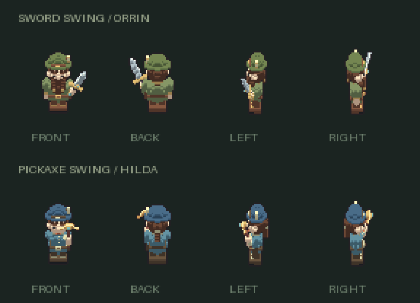
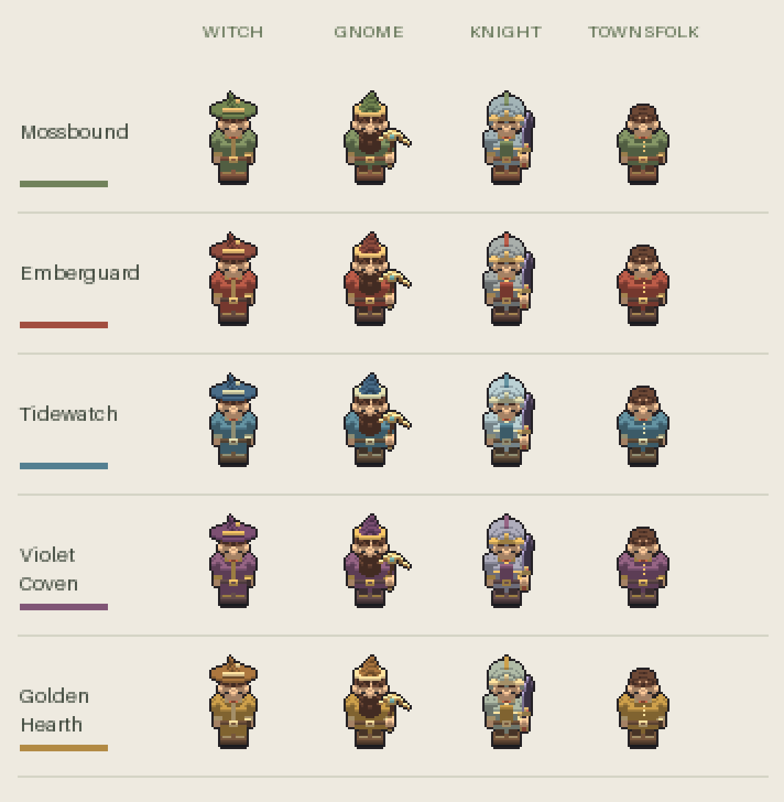

# Agent Town — Shared World & Player Workshop

A procedural, retro player asset generator for a Dwarf Fortress-inspired world. A player has **head, hat, and body**, gender, faction, class, and generated equipment. One small voxel character produces consistent **front, back, left-facing, and right-facing** pixel sprites, including sword and pickaxe swings.



## Shared world

A large, flat C/WASM world with forest, beach, ocean, volcanic, and jungle biomes, resource collection, construction, and a Cloudflare multiplayer authority. **One shared persistent world for everyone.** See [WORLD.md](WORLD.md) for setup, architecture, controls, and current limits.

## Run the workshop

Node.js 20 or later. No dependencies or package install.

```sh
npm start       # http://127.0.0.1:4173
npm test        # generator + world checks (native Clang required)
npm run build   # dist/player-workshop.html — open directly in a browser
```

The standalone build is fully offline. The development page optionally loads Google Fonts; system fonts are the fallback.

## Workshop

- Select **Man, Woman, or Nonbinary**. Gender supplies a default head style and body proportions; every head style, outfit, and tool remains available to everyone.
- Choose among six head styles, six hats (including none), four outfits, and five palettes. Hair, skin, dimensions, and details also vary with the seed.
- Regenerate or lock individual character parts. Deliberate style edits still apply to locked parts. Skin tone is shared by head and hands; generation preserves it when either head or body is locked. Clothing colors remain fixed when hat or body is locked.
- Forge **longswords, falchions, and rapiers**, or **crescent picks, prospector picks, and warpicks**. Variants change length, guard/head span, grip color, fittings, and gems. Choose iron, bronze, or obsidian materials.
- Equip either tool, play a swing, pause, scrub any of its eight frames, and select 4, 8, or 12 fps preview speed. All four directional previews animate together.
- Save and import a recipe to preserve the full edited player. A seed plus gender recreates the starting character; the recipe preserves subsequent edits and tool variants. Version 1 and 2 recipes migrate to version 3 automatically.

## Factions and classes



Choose a faction to share its clothing, headwear, trim, leather, and metal palette with every other member. The Mossbound use moss and copper; the Emberguard ember and iron; the Tidewatch blue and silver; the Violet Coven plum and gold; and the Golden Hearth ochre and earth. Skin, hair, and generated weapon materials remain individual. Unaffiliated characters can use any personal palette.

The palette is resolved from the faction definition during rendering, and imported recipes with conflicting faction colors are rejected. Random generation and class changes keep the selected faction. The **Under one banner** lineup previews all four class outfits in the current colors.

Class presets are **Witch** (broad pointed hat and coat), **Gnome** (pointed cap, broad head, tunic, and pickaxe), **Knight** (helmet, armor, colored tabard, and sword), and **Townsfolk** (everyday hats, tunics, or aprons). These are visual archetypes, not gameplay stats or a species system. A class preset reapplies its outfit, including locked parts, as an explicit outfit edit; subsequent per-part regeneration respects the class's hat/body styles. Individual style edits are still allowed without changing the class identity. Existing generated tool variants survive class changes.

Recipes now use schema version 3 and include `faction` and `classId`; version 1 and 2 imports migrate to Unaffiliated / Custom so their personal colors and equipment are retained. Generation accepts `{ faction, classId }` as its third argument. `applyClass(player, classId)` and `setFaction(player, faction)` return new player objects.

```js
const knight = createPlayer('GUARD-17', 'female', {
  faction: 'emberguard', classId: 'knight'
});
```

## How consistency works

This is a local procedural generator: no image service, AI model, or API key. Parametric voxel geometry defines the face, hair, clothing, accessories, sword, and pickaxe. Orthographic projections sample this shared model, with a small opaque palette and one-pixel silhouette. Features stay attached to the same physical side in every view.

Animations pose a shared arm rig. The sword follows the right hand; the pickaxe uses a two-handed grip. Anticipation, wind-up, strike, follow-through, and recovery include upper-body movement. Tool geometry is inverse-sampled under a rigid transform, so rotating a blade does not scatter its voxels. Every generated tool variant uses this same rig.

This is the player and asset system. Combat damage, terrain mining, navigation, and world simulation are not implemented. The animation metadata includes hit events for those future systems.

## Export contract

Every export includes **both** swing animations, regardless of which tool is currently equipped.

| File | Content |
| --- | --- |
| `player.png` | Standing character and current equipment: 192 × 48, four columns |
| `parts/{head,hat,body,tool}.png` | Complete isolated components, same standing registration |
| `layers/{head,hat,body,tool}.png` | Visible component pixels, exactly reconstructing `player.png` |
| `tools/{sword,pickaxe}.png` | Four-view inventory sheets for each generated tool |
| `animations/sword_swing.png` | Eight action frames × four directions, 512 × 256 |
| `animations/pickaxe_swing.png` | Eight action frames × four directions, 512 × 256 |
| `player.json` | Versioned player/tool recipes, atlas rectangles, anchors, timing, hit events |
| `README.txt` | Import and compositing notes |

Standing frames are **48 × 48**, foot anchor **(24, 43)**. Action frames are **64 × 64**, foot anchor **(32, 54)**, so the full tool arc fits without clipping. Place each frame using its foot anchor to keep the character planted when changing actions. Tool inventory frames have a projected grip anchor of **(24, 29)**.

Standing and inventory sheets use four columns: **front, back, left, right**. Action atlases use those directions as rows and time as eight columns. Playback defaults to **8 fps**. Frame **5**, zero-based, carries `sword_hit` or `pickaxe_hit`. First and last frames match for a clean loop. The preview speed control does not change the exported default timing.

All PNGs are transparent, native-resolution RGBA. Scale with nearest-neighbor filtering. Overlay `layers/` to reconstruct this particular standing character pixel for pixel. Rerender the shared model when swapping parts or tools: isolated components need depth testing in each direction.

## Use in a game

```js
import { createPlayer, generateTool, renderPlayer, generateAnimationSheet } from './src/generator.js';

const player = createPlayer('COPPER-005', 'female');
player.parts.head.style = 'ponytail';
player.tools.pickaxe = generateTool('pickaxe', 'MY-PICK-91');
player.equipment = 'pickaxe';

const standing = renderPlayer(player, 'left');
const striking = renderPlayer(player, 'left', undefined, {
  action: 'pickaxe_swing', frame: 5
});
const atlas = generateAnimationSheet(player, 'pickaxe_swing');
ctx.putImageData(new ImageData(striking.pixels, striking.width, striking.height), 0, 0);
```

The generator, rig, PNG writer, and ZIP writer have no DOM or canvas dependencies. Cache rendered frames in a game; do not rerender the model every tick. `src/rig.js` defines action poses and `src/generator.js` owns the procedural geometry and projections.

## Verification

Tests cover repeatable recipes and pixels; independent components; invalid recipes and version migration; all 576 standing style/direction combinations; 1,152 action frames across genders, tool shapes, extreme lengths, and directions; clean loop seams; moving bodies and tools; seed diversity; all class/gender/action combinations; faction palette invariants; class defaults and migration; left/right orientation; exact live-frame/atlas parity; independent zlib PNG decoding; ZIP checksums; manifest paths; and pixel-exact layer reconstruction. Browser checks exercise gender, equipment, styles, animation playback and scrubbing, recipe import, downloads, and responsive layout.
